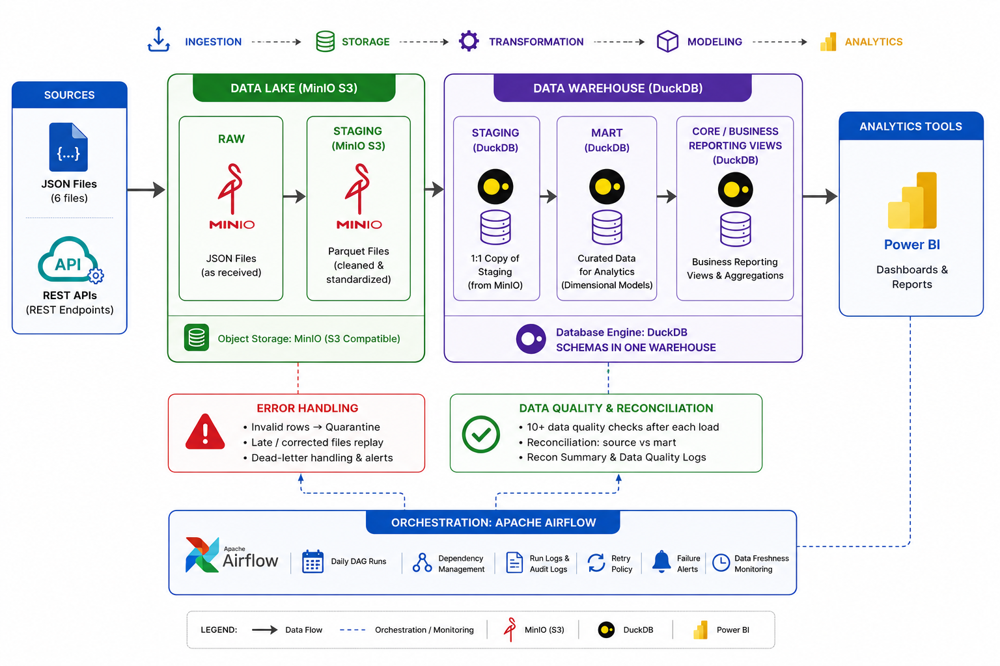

# Eat'N'Go BI Engineering Pipeline

## End-to-End Restaurant Analytics Data Platform



---

# 1. Project Overview

This project implements an end-to-end Business Intelligence (BI) data engineering pipeline for **Eat'N'Go Limited**, a multi-brand restaurant organisation operating across:

- Domino's Pizza Nigeria
- Cold Stone Creamery Nigeria
- Pinkberry Nigeria

The objective of the platform is to transform operational source data into a trusted analytical warehouse that supports reporting across:

- Sales performance
- Customer behaviour
- Product performance
- Store operations
- Delivery performance

The pipeline demonstrates a complete modern data engineering workflow:

```
Source Data
    |
    v
Raw Data Landing
    |
    v
Data Validation & Processing
    |
    v
Analytical Warehouse
    |
    v
BI Reporting Layer
    |
    v
Data Quality & Monitoring
```

The solution was designed with emphasis on:

- reliable ingestion
- reproducible processing
- clear data ownership between layers
- auditability
- data quality assurance
- BI readiness

---

# 2. Business Context

Eat'N'Go operates multiple restaurant brands where operational data is generated from different business activities including:

- customer transactions
- product sales
- store operations
- delivery activities
- promotions

Business stakeholders require a central analytical view to answer questions such as:

## Sales Performance

Examples:

- How much revenue is generated daily?
- Which brands and stores perform best?
- Which sales channels contribute the most revenue?
- How effective are promotions?

## Customer Analytics

Examples:

- Who are the highest-value customers?
- How frequently do customers purchase?
- What are customer spending patterns?

## Product Analytics

Examples:

- Which products generate the highest revenue?
- Which categories perform best?
- Which products show declining demand?

## Delivery Operations

Examples:

- Are delivery SLAs being achieved?
- Which stores experience delivery delays?
- What operational factors impact delivery performance?

---

# 3. Solution Architecture

The platform follows a layered data architecture separating ingestion, storage, transformation, modelling, and reporting responsibilities.

The primary source for this implementation is the operational JSON dataset provided for the assessment.

An API ingestion adapter is included as an extension pattern for future operational sources.

The main architecture follows:

```
Operational JSON Files

        |
        v

Source Validation

        |
        v

MinIO Object Storage
(Bronze Layer)

        |
        v

JSON Validation
+
Parquet Conversion

        |
        v

Staging Layer

        |
        v

Dimensional Warehouse
(Gold Layer)

        |
        v

BI Reporting Views

        |
        v

Quality Checks
+
Audit History
```

---

# 4. Technology Stack

| Technology | Purpose |
|---|---|
| Python | Pipeline orchestration and ingestion logic |
| MinIO | S3-compatible object storage |
| DuckDB | Analytical warehouse |
| SQL | Transformation and modelling |
| Apache Airflow | Workflow orchestration |
| Parquet | Analytical storage format |
| Docker | Local infrastructure deployment |

---

# 5. Data Architecture

The solution follows a Medallion-style architecture.

The purpose is to progressively improve data quality as information moves through each layer.

---

# Bronze Layer — Raw Data Storage

The Bronze layer stores source data exactly as received.

The principle is:

> Preserve raw data before applying transformations.

This provides:

- source traceability
- replay capability
- easier debugging
- historical auditability

Technology:

- MinIO object storage

Example:

```
raw/

└── rawjson/

    ├── customers.json

    ├── stores.json

    ├── products.json

    ├── orders.json

    ├── order_items.json

    └── deliveries.json
```

No business transformations are applied at this stage.

---

# Silver Layer — Structured Analytical Data

The Silver layer converts raw JSON into validated analytical datasets.

Responsibilities:

- schema validation
- datatype standardisation
- missing field detection
- duplicate handling
- JSON to Parquet conversion


Example:

```
Raw JSON

orders.json

       |
       v

Parquet Dataset

orders.parquet
```

Parquet was selected because it provides:

- column-based storage
- efficient analytical queries
- compression
- compatibility with modern analytics engines

---

# Gold Layer — Business Warehouse

The Gold layer contains business-ready analytical models.

It includes:

- dimensions
- fact tables
- reporting views

The warehouse follows dimensional modelling principles to support BI workloads.

---

# 6. Data Warehouse Design

The warehouse consists of:

```
                dim_customer

                     |

                     |

dim_product ---- fact_orders ---- dim_date

                     |

                     |

                dim_store

                     |

                     |

             fact_deliveries
```

---

## Staging Layer

The staging layer contains cleaned source-aligned datasets.

| Table | Purpose |
|-|-|
| staging.int_customers | Customer information |
| staging.int_stores | Store information |
| staging.int_products | Product catalogue |
| staging.int_orders | Order transactions |
| staging.int_order_items | Product-level transactions |
| staging.int_deliveries | Delivery information |

---

## Dimension Tables

Dimensions provide reusable analytical attributes.

| Dimension | Purpose |
|-|-|
| dim_customer | Customer attributes |
| dim_store | Store information and history |
| dim_product | Product classification |
| dim_date | Calendar reporting |
| dim_channel | Sales channel analysis |
| dim_payment_method | Payment analysis |
| dim_promo | Promotion analysis |

---

## Fact Tables

Facts represent measurable business events.

| Fact Table | Grain |
|-|-|
| fact_orders | One record per order |
| fact_order_items | One record per order-product combination |
| fact_deliveries | One record per delivery |

Defining grain explicitly prevents incorrect reporting calculations.


Alright my guy, continuing from where we stopped. This is **Part 2 (final part)** of the rewritten README.

---

# 7. Pipeline Execution Flow

The pipeline executes through a series of controlled stages designed to ensure reliability, traceability, and data accuracy.

---

## Stage 1 — Source Validation

Before ingestion begins, the pipeline validates the availability and integrity of source data.

For the JSON workflow, validation includes:

- required file availability
- file completeness
- file size checks
- content fingerprint generation
- duplicate source detection


Example:

```text
dataSource/

├── customers.json
├── stores.json
├── products.json
├── orders.json
├── order_items.json
└── deliveries.json
```

A source fingerprint is generated using:

- file name
- file size
- content hash


This prevents unnecessary reprocessing of unchanged source files.

Example:

```
Previous Run

orders.json
hash = abc123


Current Run

orders.json
hash = abc123


Result:

No change detected
Pipeline skipped
```

---

# Stage 2 — Raw Data Landing

Validated files are copied into MinIO object storage.

The raw layer maintains the original source representation before transformation.

Example:

```
MinIO

rawjson/

├── customers/
│
├── stores/
│
├── products/
│
├── orders/
│
├── order_items/
│
└── deliveries/
```

Benefits:

- source preservation
- recovery capability
- audit history
- separation between ingestion and transformation

---

# Stage 3 — Data Processing and Conversion

Raw JSON files are processed through validation and conversion steps.

The process performs:

- schema validation
- required field checks
- datatype validation
- transformation preparation
- JSON-to-Parquet conversion


Example:

```
Raw JSON

      |
      v

Schema Validation

      |
      v

Parquet Dataset

      |
      v

Staging Tables
```

---

# Stage 4 — Staging Transformation

The staging layer creates clean, consistent datasets ready for warehouse modelling.

Transformations include:

- column standardisation
- duplicate removal
- business rule application
- data preparation


Example:

```
staging.int_orders

staging.int_customers

staging.int_products

staging.int_deliveries
```

The staging layer maintains close alignment with source entities while preparing data for analytical models.

---

# Stage 5 — Warehouse Loading

After staging validation, data is loaded into the dimensional warehouse.

The warehouse contains:

- dimension tables
- fact tables
- reporting views


The modelling approach follows star schema principles.

Benefits:

- simpler reporting queries
- reusable business definitions
- improved analytical performance

---

# 8. Business Rules and Transformations

Business logic is implemented primarily using SQL transformations.

This keeps analytical rules:

- transparent
- testable
- easy to maintain

---

## Sales Logic

`order_ts` is treated as the authoritative business timestamp.

It supports:

- daily sales reporting
- revenue trends
- customer behaviour analysis
- product performance analysis

---

## Order Fact

`fact_orders` maintains order-level grain.

Metrics supported:

- total orders
- revenue
- average order value
- payment analysis
- sales channel performance

---

## Order Item Fact

`fact_order_items` maintains product-level grain.

This avoids incorrect product analysis caused by joining product metrics directly with order-level data.

Supports:

- product revenue
- quantity analysis
- category performance
- best-selling products

---

## Delivery Fact

`fact_deliveries` supports operational reporting.

Metrics include:

- delivery duration
- SLA compliance
- delivery delays
- store delivery performance

---

# 9. Slowly Changing Dimension (SCD Type 2)

The store dimension implements SCD Type 2 history tracking.

The purpose is to preserve historical changes rather than overwrite previous values.

Example:

Before:

```
Store A
Location = Lagos
```

After relocation:

```
Store A
Location = Abuja
```

The warehouse maintains:

```
Store A | Lagos | Valid From | Valid To

Store A | Abuja | Current
```

This allows historical reporting based on the correct business state at that point in time.

---

# 10. Data Quality Framework

Data quality checks are executed after warehouse loading.

The framework separates:

- blocking failures
- non-blocking warnings


---

## Blocking Checks

Failures stop the pipeline.

Examples:

- missing primary keys
- duplicate business identifiers
- invalid foreign keys
- incorrect totals
- invalid delivery values


Example:

```
Delivery record

delivery_id = 123

order_id = NULL


Result:

FAILED
Pipeline stopped
```

---

## Warning Checks

Warnings do not stop processing.

They remain visible for investigation.

Examples:

- unusual daily order spikes
- zero-value promotions
- unexpected business patterns


---

## Quality Audit Tables

Results are stored in:

```
audit.data_quality_results

audit.data_quality_exceptions

audit.data_quality_results_history

audit.data_quality_exceptions_history
```

Each result contains:

- run identifier
- check name
- execution timestamp
- status
- exception details

---

# 11. Reconciliation Framework

Reconciliation validates that data remains consistent across pipeline stages.

The process compares:

- source records
- staging records
- warehouse records
- reporting outputs


Examples:

## Orders

```
Source Orders

1000


Warehouse Orders

1000


Result:

PASS
```

---

## Deliveries

Validation includes:

- delivery count consistency
- store distribution
- delivery status accuracy


Failed reconciliation prevents the pipeline from being considered successful.

---

# 12. Metadata and Observability

Operational visibility is an important part of the platform.

The pipeline captures metadata around every execution.

Tracked information includes:

- execution date
- run ID
- source processed
- record counts
- processing status
- quality results
- reconciliation status
- failure details


Example:

```
Pipeline Start

      |

Generate Run ID

      |

Process Source

      |

Execute Transformations

      |

Run Quality Checks

      |

Store Audit Result
```

---

# 13. Logging Strategy

The pipeline uses structured logging for operational visibility.

---

## Information Logs

Examples:

```
Pipeline execution started

Loaded 1000 orders

Converted JSON to Parquet

Quality checks completed
```

---

## Warning Logs

Examples:

```
Unexpected order volume increase

Missing optional attribute
```

---

## Error Logs

Examples:

```
Schema validation failed

Warehouse load failed

Reconciliation mismatch
```

---

In a production environment, logs can be integrated with:

- CloudWatch
- Datadog
- ELK Stack
- Grafana Loki

---

# 14. Airflow Orchestration

Apache Airflow manages workflow execution.

Responsibilities include:

- scheduling
- dependency management
- retries
- failure handling
- monitoring


Pipeline workflow:

```
Validate Source

      |

Land Raw Data

      |

Convert Data

      |

Build Warehouse

      |

Run Quality Checks

      |

Run Reconciliation

      |

Complete Pipeline
```

---

## Failure Handling

The workflow supports:

- automatic retries
- task-level logging
- failure notifications
- execution monitoring


Example:

```
Task Failure

      |

Retry

      |

Retry Failed

      |

Notify Owner
```

---

# 15. API Integration Extension

The current assessment implementation is based on operational JSON files.

The API module is included as a future integration pattern.

The purpose is to demonstrate how additional operational sources can be introduced without redesigning the downstream architecture.

Possible future sources:

- delivery providers
- payment platforms
- CRM systems
- third-party marketplaces


---

## API Design Pattern

```
External API

      |

API Extraction Layer

      |

MinIO Raw Storage

      |

Existing Processing Pipeline

      |

Warehouse
```

---

## API Capabilities Implemented

The adapter supports:

- authentication handling
- pagination
- retries
- rate-limit handling
- incremental extraction
- watermark tracking
- raw response storage


The API does not directly load the warehouse.

Instead, it follows the same principle:

> Land first, transform later.

Benefits:

- reproducibility
- auditability
- easier debugging
- consistent downstream processing

---

# 16. Running The Project

## Requirements

- Python 3.12+
- Docker Desktop
- Docker Compose


Install dependencies:

```bash
pip install -r requirements.txt
```

---

# Local Execution

Run the complete pipeline:

```bash
python scripts/run_pipeline.py --mode local
```

---

# JSON Pipeline

Run the assessment pipeline:

Process:

```
JSON Source

|

MinIO

|

Parquet

|

Warehouse

|

Quality Checks

|

Reporting Views
```

---

# Airflow Execution

Start services:

```bash
docker compose up airflow-init

docker compose up -d
```

Airflow UI:

```
http://localhost:8080
```

---

# 17. Repository Structure

```
.

├── api/
│
├── dags/
│
├── dataSource/
│
├── docs/
│
├── pipeline/
│
├── scripts/
│
├── warehouse/
│
├── docker-compose.yaml
│
└── README.md
```

---

# 18. Production Considerations

The current implementation is designed for a local BI engineering environment.

For production deployment:

---

## Metadata Storage

Current:

- DuckDB metadata tables
- local state files


Production:

- PostgreSQL metadata database


Benefits:

- concurrency
- stronger recovery
- operational reporting

---

## Storage

Current:

- MinIO


Production alternatives:

- Amazon S3
- Azure Data Lake Storage
- Google Cloud Storage


Additional controls:

- encryption
- lifecycle policies
- access control
- retention management

---

## Warehouse

Current:

- DuckDB


Suitable because:

- dataset size is manageable
- local analytical workloads are efficient


Production alternatives:

- Snowflake
- BigQuery
- Redshift
- Azure Synapse


---

## Secrets Management

Current:

- environment variables


Production:

- AWS Secrets Manager
- Azure Key Vault
- Hashicorp Vault


---

## Monitoring Improvements

Future enhancements:

- SLA monitoring
- freshness checks
- alert escalation
- operational dashboards
- incident management integration


---

## CI/CD Improvements

A production deployment pipeline should include:

- automated testing
- SQL validation
- DAG validation
- container testing
- deployment approvals


---

# Conclusion

This project demonstrates a complete BI engineering workflow from source ingestion to analytical reporting.

The design focuses on:

- reliable ingestion
- layered data architecture
- dimensional modelling
- data quality assurance
- operational visibility
- future extensibility

The result is an auditable and maintainable analytical platform capable of supporting restaurant business intelligence requirements.

---
