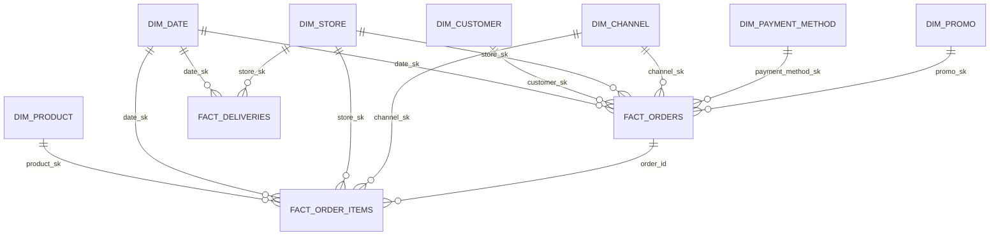

# Eat N' Go — BI Engineer Case Study
## Technical Documentation

*Status: completed implementation and operating guide for Questions 1–12.*

---

## 1. Architecture Overview

**Storage:** MinIO (S3-compatible object storage)
**Compute:** DuckDB
**Language:** SQL, with Python only where DuckDB SQL is impractical (e.g. orchestration scripting)

**Layers:**

| Layer | Location | Format | Purpose |
|---|---|---|---|
| Raw | `s3://rawjson/ingestion_date={load_date}/*.json` | JSON | Immutable landing zone, exactly as received from source systems. Each partition also contains a `_manifest.json` recording which files loaded successfully, sizes, and any failures for that run. |
| Staging (parquet) | `s3://staging/{source}/load_date={load_date}/*.parquet` | Parquet | Schema-applied (typed, metadata added), still 1:1 grain with source — no business rules applied yet |
| Marts | DuckDB native tables | Parquet-backed | Fact/dimension model, business rules and derived fields applied |
| Reporting | DuckDB views | — | Final semantic layer exposed to Power BI / Tableau / Looker |

**Metadata columns added at the staging (parquet) step:** `_source_file`, `_loaded_at`, `_batch_id`

**Design rationale:**
- Raw JSON is never modified after landing — it is the audit trail and source of truth for "what did we actually receive."
- Conversion to parquet happens via DuckDB itself (`read_json_auto` → `COPY ... TO parquet`) rather than a separate tool, keeping the pipeline within a single query engine and simplifying documentation/maintainability.
- Parquet staging is partitioned by `load_date` (and source entity) to support pruning and to make late-arriving/corrected files traceable to a specific load event.
- **Late/corrected-file rule:** every arrival is retained in raw JSON under its arrival `ingestion_date`. Parsed Parquet is partitioned by the same load date. Staging reads all Parquet partitions and retains the newest `_loaded_at` record for each business key, so a late or corrected arrival supersedes the earlier version without deleting the raw audit trail.

---

## 2. Source File Profiling (Question 1)

| File | Row Count | Primary Key | Foreign Keys | Notes |
|---|---|---|---|---|
| customers.json | 2,000 | customer_id (unique) | — | No nulls, no duplicates. Signup dates range 2024-08-01 to 2025-07-31. |
| stores.json | 12 | store_id (unique) | — | 5 cities represented (Lagos, Port Harcourt, Ibadan, Benin City, Abuja implied via customers). |
| products.json | 24 | product_id (unique) | — | 4 categories: Pizza, Dessert, Sides, Beverage. |
| orders.json | 1,000 | order_id (unique) | store_id, customer_id (both 100% valid against master) | Order dates range 2025-08-01 to 2025-10-31. |
| order_items.json | 1,733 | composite (order_id, product_id) | order_id → orders, product_id → products (100% valid) | No orphaned rows. |
| deliveries.json | 454 | order_id (unique, 1:1 with a subset of orders) | order_id → orders (100% valid) | Only exists for `Delivery` and `Online App` channel orders — exact match (304 + 150 = 454). |

**Key-field and type summary:** `customer_id`, `store_id`, `product_id`, and `order_id` are text business keys. `order_ts` is parsed as a timestamp; `signup_date` is a date. Currency/price fields are numeric, quantities and SLA minutes are integers, and status/category/channel fields are text. `order_items` uses `(order_id, product_id)` as its composite key. No source has duplicate business keys or orphaned foreign keys; the source profiling found no critical-key nulls.

**Reconciliation checks performed (all pass):**
- `SUM(order_items.line_total_ngn)` per order matches `orders.subtotal_ngn` exactly for all 1,000 orders.
- `orders.items_count` and `orders.qty_total` match actual `order_items` aggregates exactly.
- No exact-duplicate rows in any of the 6 files.
- No negative revenue values.
- No orphaned foreign keys in any relationship.

**Data quality observations (to carry into Question 6 DQ checks):**
1. **151 orders** have a `promo_code` set but `discount_ngn = 0` (concentrated in `WKND20` and `MIDWEEK15`), while the same codes correctly show a discount elsewhere — flagged as an exception, not silently corrected.
2. **404 of 1,000 orders (40%)** have an `order_ts` outside the stated store `opening_hours` (09:00–23:00) — flagged for business review rather than treated as invalid data, since the cause is unconfirmed.
3. **499 of 1,733 order_items** have `unit_price_ngn` different from the current `products.base_price_ngn` — interpreted as price-at-time-of-sale vs. current master price (normal in retail), not treated as an error.
4. **Redundant delivery fields:** `orders.json` carries `promised_delivery_minutes` / `actual_delivery_minutes`, duplicating fields in `deliveries.json`. Verified 100% agreement between the two sources where both exist. **Design decision: `deliveries` is treated as the single source of truth for delivery metrics in the dimensional model; the duplicate columns on `orders` are not carried into the marts layer**, to avoid conflicting sources of truth.

---

## 3. Data Model Grain (feeds Question 4)

| Fact Table | Grain | Notes |
|---|---|---|
| fact_orders | 1 row per order_id | Order header and monetary fields |
| fact_order_items | 1 row per (order_id, product_id) | Product-mix / line-item detail |
| fact_deliveries | 1 row per order_id, only for orders with a delivery leg | Partial coverage by design — not all orders have deliveries |

**Avoiding double counting:** revenue analysis should use `fact_orders` only. `fact_order_items` exists for product-mix reporting and must not be summed alongside `fact_orders` revenue in the same query without an explicit grain note in the BI semantic layer.

---

## 4. Schema Drift Detection (feeds Question 2 and Question 9)

**Approach: manifest-based validation, checked before each JSON→parquet conversion.** Implemented in `schema_manifest.json` (expected schema per source) and `pipeline/raw.py` (validation + conversion).

- `schema_manifest.json` stores the expected column names and DuckDB-inferred types for each of the 6 sources, derived from `DESCRIBE SELECT * FROM read_json_auto(...)` against the actual files.
- Before converting an incoming raw JSON file to parquet, DuckDB introspects its actual columns and diffs the result against the manifest.
- **New column appended** → non-breaking. Load proceeds; a warning is logged and the manifest is flagged for review/update.
- **Column removed** → breaking. That source's load halts and the batch's conversion manifest records the missing column(s); other sources are unaffected.
- **Type change** → classified by whether both the expected and actual types are numeric. **Numeric widening** (e.g. `BIGINT`→`DOUBLE`) is treated as non-breaking, since fields like `delivery_fee_ngn` and `base_price_ngn` are currently inferred as `BIGINT` only because every sample value happens to be a whole number — a future fractional value is expected, not an error. Any other type change (e.g. `VARCHAR`↔`BIGINT`) is breaking.

This was chosen over passive schema inference (letting DuckDB infer and only logging differences after the fact) because it actively governs what's allowed to flow downstream rather than discovering problems after they've already landed in staging.

**Verification:** ran the classifier against all 6 real source files — all pass clean with no drift. Simulated a breaking case (VARCHAR vs. expected BIGINT) and a non-breaking case (numeric widening) to confirm the classifier behaves as designed.

**Implementation note — Hive-partition auto-detection:** DuckDB's `read_json_auto` automatically infers a `key=value` folder segment (e.g. `ingestion_date=2026-07-23/`) as a partition column and silently injects it into every row's schema. Since our raw-layer path convention uses exactly that pattern, this surfaced as a spurious `ingestion_date` column on every source during a live run. Fixed by passing `hive_partitioning=false` explicitly to `read_json_auto` in both the schema-check and conversion steps — lineage/load-date tracking is handled deliberately via the `_loaded_at` metadata column instead, rather than relying on an implicit, path-derived one.

---

## 5. Implementation Notes
- Parquet staging is partitioned by source entity and load date.
- Data quality coverage is implemented in `warehouse/data_quality.sql` and includes more than the 10 checks required by the assessment.
- Source profiling queries are available in `warehouse/source_profiling.sql`.

---

## 6. JSON Parsing and Source-to-Target Mapping (Question 3)

`pipeline/landing.py` uploads each supplied file unchanged to `s3://rawjson/ingestion_date={execution_date}/`. `pipeline/raw.py` checks the incoming schema and converts each file to typed Parquet in `s3://staging/{source}/load_date={execution_date}/`. `pipeline/staging.py` then builds the cleaned DuckDB `staging.int_*` tables.

| Source | Staging target | Key parsing and transformation rules |
|---|---|---|
| customers.json | `staging.int_customers` | Deduplicate by `customer_id`, retaining the newest `_loaded_at` record. |
| stores.json | `staging.int_stores` | Deduplicate by `store_id`; trim `city` into `clean_city`. |
| products.json | `staging.int_products` | Deduplicate by `product_id`; replace a null category with `Uncategorized`. |
| orders.json | `staging.int_orders` | Parse `order_ts` as timestamp; retain monetary fields; derive calendar and customer cohort fields. |
| order_items.json | `staging.int_order_items` | Deduplicate by `(order_id, product_id)`; derive `quantity`, `unit_price`, and `product_revenue`. |
| deliveries.json | `staging.int_deliveries` | Parse `order_ts`; derive `delay_minutes` and the SLA flag. |

Each parsed record carries `_source_file`, `_loaded_at`, and `_batch_id`. Bad timestamp formats become null through `TRY_CAST` and are reported immediately, rather than silently changing the source value or failing the whole batch.

### Source-to-Target Table Dictionary

| Layer | Object | Grain | Key Fields | Purpose |
|---|---|---|---|---|
| Raw | `s3://rawjson/ingestion_date={date}/*.json` | Source file | File name + ingestion date | Immutable copy of each received JSON file. |
| Staging parquet | `s3://staging/{source}/load_date={date}/{source}.parquet` | Source record | Source business key + `_batch_id` | Typed JSON parsed to Parquet with load metadata. |
| Staging table | `staging.int_customers` | One row per customer | `customer_id` | Deduplicated customer master. |
| Staging table | `staging.int_stores` | One row per store | `store_id` | Cleaned store attributes and city standardization. |
| Staging table | `staging.int_products` | One row per product | `product_id` | Product master and category normalization. |
| Staging table | `staging.int_orders` | One row per order | `order_id` | Order header facts, calendar fields, promo flag, and customer cohort fields. |
| Staging table | `staging.int_order_items` | One row per order/product line | `order_id`, `product_id` | Product-level transaction detail and product revenue. |
| Staging table | `staging.int_deliveries` | One row per delivered order | `order_id` | Delivery timing, delay, and SLA status. |
| Mart dimension | `marts.dim_store` | SCD2 row per store version | `store_sk`, `store_id` | Historical store dimension. Initial bootstrap starts at `1900-01-01` so historical orders join correctly. |
| Mart dimension | `marts.dim_customer` | One row per customer | `customer_sk`, `customer_id` | Customer reporting dimension. |
| Mart dimension | `marts.dim_product` | One row per product | `product_sk`, `product_id` | Product reporting dimension. |
| Mart dimension | `marts.dim_date` | One row per calendar date | `date_sk` | Date attributes for BI filtering and grouping. |
| Mart dimension | `marts.dim_channel` | One row per channel | `channel_sk` | Channel lookup. |
| Mart dimension | `marts.dim_payment_method` | One row per payment method | `payment_method_sk` | Payment method lookup. |
| Mart dimension | `marts.dim_promo` | One row per promo code plus no-promo row | `promo_sk` | Promotion lookup with a non-null no-promo key. |
| Mart fact | `marts.fact_orders` | One row per order | `order_id` | Order-level revenue and customer/order KPIs. |
| Mart fact | `marts.fact_order_items` | One row per order/product line | `order_id`, `product_id`, `product_sk` | Product mix, units, and product revenue with direct date, store, and channel keys. |
| Mart fact | `marts.fact_deliveries` | One row per delivered order | `order_id` | Delivery SLA and delay measures. |
| BI view | `core.vw_sales_performance` | Date/store/channel | `full_date`, `store_id`, `channel` | Sales dashboard semantic view. |
| BI view | `core.vw_delivery_performance` | Date/store | `full_date`, `store_id` | Delivery dashboard semantic view. |
| BI view | `core.vw_product_performance` | Date/store/channel/product | `full_date`, `store_id`, `channel`, `product_id` | Product performance semantic view without fact-to-fact joins. |
| BI view | `core.vw_customer_summary` | Customer | `customer_id` | Customer lifetime summary. |

## 7. Dimensional Model (Question 4)

The model keeps order-level and item-level measures separate, preventing revenue from being multiplied when an order has multiple lines.

The submission-ready diagram is available at `docs/eat_ngo_data_model_diagram.svg`.

- `marts.fact_orders`: one row per `order_id`; order header, order totals, customer/store/channel/payment/promo keys.
- `marts.fact_order_items`: one row per `(order_id, product_id)`; quantities and product revenue. It carries direct date, store, and channel keys so product reporting does not need a fact-to-fact join through `fact_orders`.
- `marts.fact_deliveries`: one row per delivered order; promised/actual times, delay, and SLA result.
- `marts.dim_store` is SCD Type 2. Facts join to the store version effective on the order date; prior store attributes remain historically correct.

## 8. Reporting Transformations (Question 5)

The staging layer derives order year, month, week, day-of-week, hour, promo flag, new-versus-returning status, customer type, delivery delay, and clean store/city values. The mart preserves source monetary measures (`subtotal_ngn`, discount, tax, delivery fee, and total amount) while `marts.rpt_order_summary` derives item count and item-level revenue per order.

The BI-facing `core` views expose consistent KPIs:

- `core.vw_sales_performance`: order count, total revenue, average order value, average items per order, and customer/promo mix by date, store, and channel.
- `core.vw_delivery_performance`: delivery count, SLA compliance, average delivery time, and delay by date and store.
- `core.vw_product_performance`: units and revenue by date, store, channel, and product.
- `core.vw_customer_summary`: lifetime order count, revenue, and recency per customer.

## 9. Data Quality and Reconciliation (Questions 6-7)

`warehouse/data_quality.sql` runs after each successful pipeline load and writes the latest results to `audit.data_quality_results`; failed or reviewable rows are retained in `audit.data_quality_exceptions`. It also appends run-level records to `audit.data_quality_results_history` and `audit.data_quality_exceptions_history`, keyed by `run_id` and `execution_date`. Rerunning the same `run_id` replaces that run's history rows, so recovery runs stay idempotent instead of creating duplicate audit evidence. The exception table includes severity, source table, record key, issue, recommended action, source file, and load timestamp, so operations can investigate specific failed rows rather than only seeing aggregate counts. `audit.vw_data_quality_exception_summary` provides a compact triage view by check and source table. The checks cover record count, uniqueness, foreign-key, null, negative-value, invalid-channel, delivery-coverage, SLA-flag, promotion, order total, order-item subtotal, missing mart mapping, model grain, surrogate-key uniqueness, null fact foreign keys, recent late-arriving-data, and unusual-volume-change rules.

`warehouse/reconciliation.sql` writes the latest reconciliation result to `audit.reconciliation_summary` and maintains `audit.reconciliation_summary_history` for the run-level trail. It compares staging against the reporting facts for overall order, order-item, delivery, product revenue, promo, and SLA counts. It also reconciles order counts and revenue by store and channel, product revenue by product, promo order counts by promo code, and delivery counts by store. Every row has source value, reporting value, variance, and pass/fail status, providing an auditable refresh record.

Validation against the supplied sample data produces no failed checks after applying a small financial rounding tolerance for one-kobo arithmetic differences. It retains two warning categories for business review: promotion codes with zero discount and daily order-volume changes above the configured threshold. Historical assessment data is not treated as late-arriving noise; the late-arrival rule is scoped to the recent operational window.

## 10. Automation, Refresh, and Late Data (Question 9)

The Airflow implementation is split by source type instead of hiding both inputs inside one generic DAG:

- `dags/json_source_dag.py` defines `eat_ngo_json_source_pipeline` for the normal file-drop route.
- `dags/api_source_dag.py` defines `eat_ngo_api_source_pipeline` for vendor/API feeds.
- `dags/common_pipeline.py` holds the shared warehouse, data-quality, reconciliation, and alerting task helpers.

The submission-ready pipeline diagram is available in Mermaid format at `docs/eat_ngo_pipeline_architecture.md`.

The JSON source flow runs the following strictly ordered process:

1. Landing JSON to the immutable `rawjson` bucket.
2. Schema validation and JSON-to-Parquet conversion to the `staging` bucket.
3. Cleaned DuckDB staging tables.
4. Store SCD Type 2 update, marts, and semantic views.
5. Data-quality checks and reconciliation summary.

The API source flow starts with `pipeline/api_ingest.py`, which authenticates, handles pagination/retries, lands the API payload as raw JSON, and only advances its watermark after a successful extraction. After that, it joins the same raw, staging, mart, audit, and reconciliation path as the JSON flow.

Airflow retries failed tasks twice and records task logs. Each source load has a manifest; a corrected file can be replayed for the relevant `load_date`. The Parquet partition for that date is overwritten, staging deduplicates on business keys, and the raw JSON audit copy is retained.

### Late or corrected file scenario

For example, a file containing corrections for orders from 24 July may arrive on 25 July. It is **not discarded**. The pipeline lands it as a new immutable raw object with `ingestion_date=2026-07-25`; its original business date remains available in `order_ts`. The file is then parsed into the 25 July Parquet partition. When staging rebuilds, it reads all partitions and selects the newest `_loaded_at` record for each business key (`order_id`, `(order_id, product_id)`, and so on). The marts and BI views are rebuilt from that current, deduplicated state. This preserves both the corrected result and the earlier raw file for audit.

## 11. API Integration Extension (Question 10)

`pipeline/api_ingest.py` is a reusable API-ingestion design for a future delivery partner or any other provider/store API. Credentials are read only from environment variables or command-line parameters. It supports OAuth client credentials, bearer tokens, or unauthenticated development endpoints; optional provider/store filters; pagination; rate-limit and server-error retry logic; raw API response storage in `rawjson`; vendor-count reconciliation; and watermark advancement only after a successful raw write.

The API extraction strategy is interval-based rather than an unbounded "give me everything since last run" call. The preferred window is `[interval_start, interval_end)`, split into 60-minute chunks. Normal incremental runs resume from the last successful watermark, rewind by a 10-minute overlap to catch late provider updates, then advance the watermark to the successful interval end. This is a good default for restaurant/delivery data because order and delivery events can be corrected shortly after creation, while hourly chunks keep retries small and logs easy to inspect. For backfills, `scripts/run_api_pipeline.py` accepts explicit `--api-interval-start` and `--api-interval-end` values.

When the API replaces the deliveries file, its response is normalised to the existing `deliveries.json` contract and lands at the same raw path expected by the downstream pipeline, so no separate warehouse model is required. The endpoint paths are placeholders because no vendor API specification was supplied.

## 12. Monitoring and Incident Response (Question 11)

- **Pipeline health:** Airflow task status, retry/failure emails, and the raw/conversion manifests show each run’s outcome.
- **Freshness:** alert if the latest successful `_loaded_at` is older than the expected daily run window.
- **Missing stores:** alert on a zero store/day combination in `core.vw_sales_performance` when that store has historical activity; investigate source arrival, raw manifest, staging record count, and mart joins in that order.
- **Data anomalies:** alert on a failed `audit.data_quality_results` row, failed reconciliation, or material daily revenue/count variance from the prior period.
- **Incident process:** capture run ID and affected source/date, preserve raw data, identify the failed layer, correct/reload the affected date, rerun the audit steps, and document resolution in the run log.

## 13. Limitations and Future Improvements (Question 12)

- API handling awaits the vendor’s endpoint, authentication, and payload contract.
- The current data quality script stores exceptions in DuckDB; production deployment should additionally forward alerts to the operational alerting platform.
- Store SCD2 presently tracks city. Additional reportable store attributes should be added to its hash when their source semantics are agreed.
- Add automated unit/integration tests and CI validation before production deployment.
